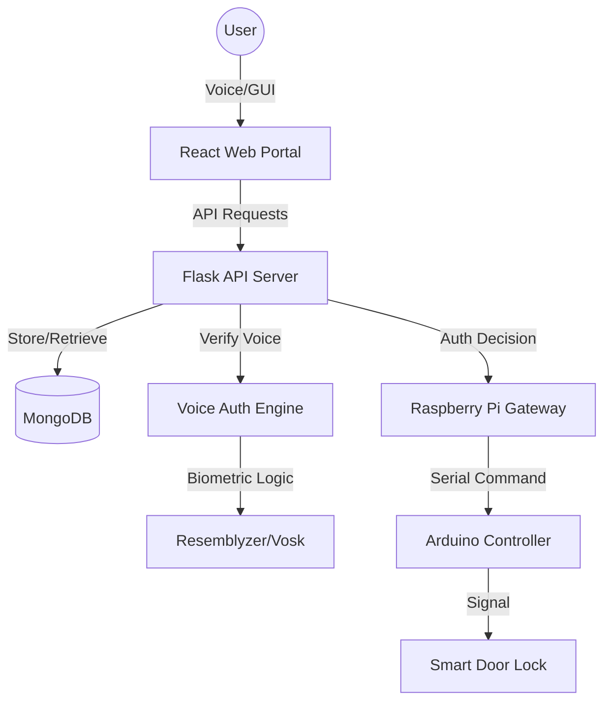

# Kavach: AI-Powered Smart Voice Authentication Door Unlock System

[](https://reactjs.org/)
[](https://flask.palletsprojects.com/)
[](https://www.mongodb.com/)
[](https://www.python.org/)
[](https://www.raspberrypi.org/)

**Kavach** is a sophisticated, multi-layered security system that leverages cutting-edge AI for voice-based biometric authentication to control physical access. Designed as a smart door unlock system, it combines a modern web-based management portal, a robust Python backend, and an integrated hardware pipeline using Raspberry Pi and Arduino.

---

## 🏗️ System Architecture



---

## ✨ Key Features

### 🔐 Biometric Security
- **Voice Fingerprinting**: Uses `Resemblyzer` to generate high-dimensional embeddings for unique voice identification.
- **Anti-Spoofing & Noise Reduction**: Integrated noise reduction and WebRTC VAD to ensure high-fidelity voice capturing.
- **Multi-Factor Potential**: Designed to work as a standalone biometric or a secondary layer of security.

### 🌐 Management Portal (Frontend)
- **Family Management**: Add, update, and manage family members and their access permissions.
- **Voice Enrollment**: Interactive UI for enrolling voice samples.
- **Real-time Monitoring**: System dashboards for tracking access logs and security status.
- **Modern UI/UX**: Built with React 19, Tailwind CSS, and Radix UI for a premium, responsive experience.

### ⚙️ Backend & AI Pipeline
- **Secure API**: Flask-based REST API with JWT-based authentication for admins and members.
- **Recognition Engine**: Integration with `Vosk` for speech-to-text validation and keyword detection.
- **Scalable Database**: MongoDB for high-performance storage of user profiles and authentication metrics.

### 🛠️ Hardware Integration
- **Raspberry Pi Gateway**: Acts as the central bridge between the cloud/local backend and physical hardware.
- **Serial Communication**: Precise control of the door mechanism via Arduino using dedicated protocols.

---

## 🚀 Tech Stack

### Frontend
- **Framework**: React 19 (Vite)
- **Styling**: Tailwind CSS 4.0
- **UI Components**: Radix UI, Shadcn/UI
- **Icons**: Lucide React
- **State Management**: TanStack Query (React Query)

### Backend
- **Language**: Python 3.x
- **Framework**: Flask
- **ORM/ODM**: MongoEngine
- **Authentication**: Flask-JWT-Extended, Flask-Bcrypt
- **CORS**: Flask-CORS

### AI / Machine Learning
- **Biometrics**: Resemblyzer (Voice Embeddings)
- **Speech-to-Text**: Vosk
- **Processing**: Numpy, SoundFile, Pydub, Librosa
- **Noise Control**: NoiseReduce, WebRTCVAD

### Hardware
- **Controllers**: Raspberry Pi 4/5, Arduino Uno
- **Comm**: Python Serial (PySerial)
- **Server**: Flask (Pi Gateway)

---

## 🛠️ Installation & Setup

### Prerequisites
- Python 3.10+
- Node.js 20+
- MongoDB instance (local or Atlas)
- Hardware: Raspberry Pi & Arduino (Optional for software testing)

### 1. Backend Setup
```bash
cd newBackend
pip install -r requirements.txt
python run.py
```

### 2. Frontend Setup
```bash
cd Frontend
npm install
npm run dev
```

### 3. AI Module Configuration
Configure the `.env` in `AI/door-unlock-system-backend/` with your Mongo URI and `SIMILARITY_THRESHOLD`.

---

## 👨‍💻 Author
**Kavach Team** - *Empowering Security through Innovation.*

---

## ⚖️ License
This project is licensed under the MIT License - see the `LICENSE` file for details.
